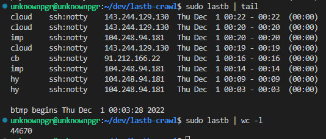

# SSH brute-force analyzer



If you leave a server open with an public IP, there will be many SSH brute force login attacks.
I thought that analyzing this log will give an interesting insight,
so I wrote two scripts for analyzing ssh brute-force attacks.

- `src-btmp/main.py` parses the output of the `lastb` command and stores it into a sqlite database.
- `src-ssh/main.py` opens fake ssh server and record attacks, including source ip address, port, username and even tried password.

## Requirements

- docker
- docker-compose

## Usage

- run `run.sh` script. It will build docker images and run them via docker-compose.
- Fake ssh server will be opened at port 2222. This configuration can be changed by modifying `docker-compose.yaml`.

Refer to `reader.py` file for log analyzing examples.

## Example

Below is result of `reader.py`.

- 44440 attacks were conducted for 20 days.
- You must not allow password login for username `admin`, `ubuntu`, `user`, ..., etc.
- Source IPs of attacks were mostly of the United States.

```
Period:
('2022-11-30 15:03:28', '2022-12-21 14:19:17', 20)

Total collected log count:
44440

Top 10 username:
('admin', 2217)
('ubuntu', 1534)
('user', 1273)
('test', 1205)
('oracle', 940)
('postgres', 855)
('git', 692)
('dell', 590)
('mysql', 514)
('ftpuser', 455)

IPs:
('170.64.134.5', 1787)
('159.89.166.45', 1541)
('170.64.144.48', 1521)
('170.64.158.80', 1495)
('64.227.65.70', 1309)
('165.232.189.42', 1003)
('104.248.94.181', 789)
('2.207.190.50', 533)
('85.31.46.213', 528)
('152.89.196.123', 274)
```
